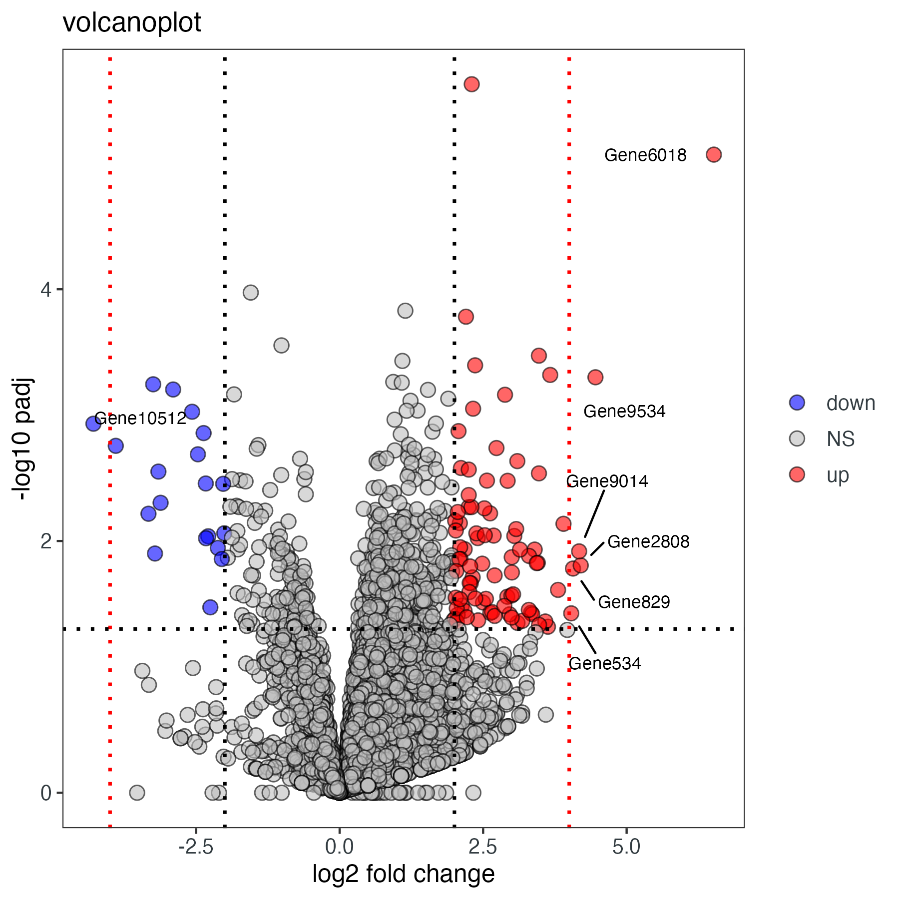
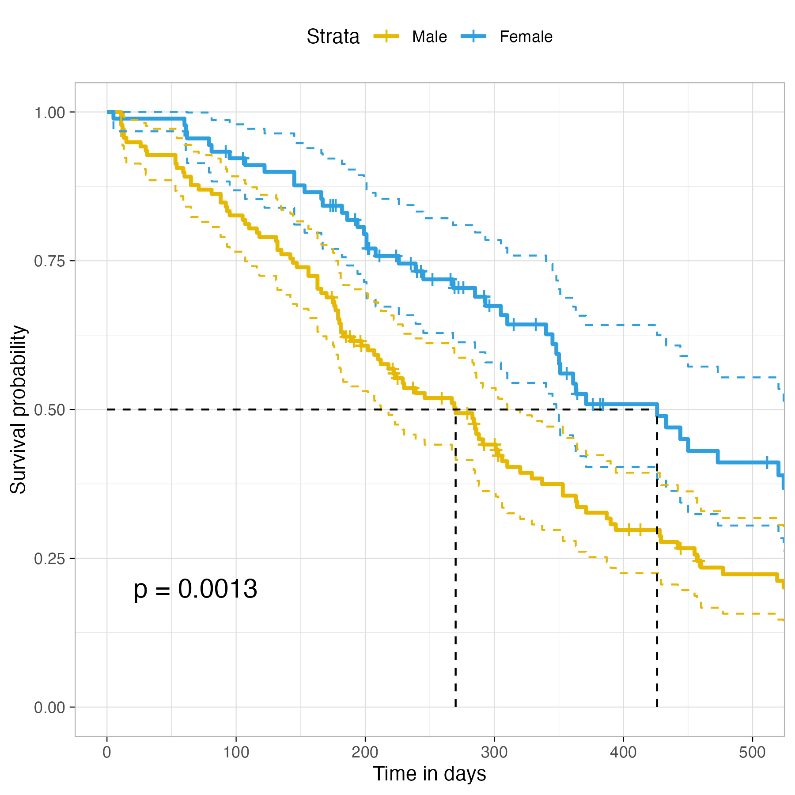
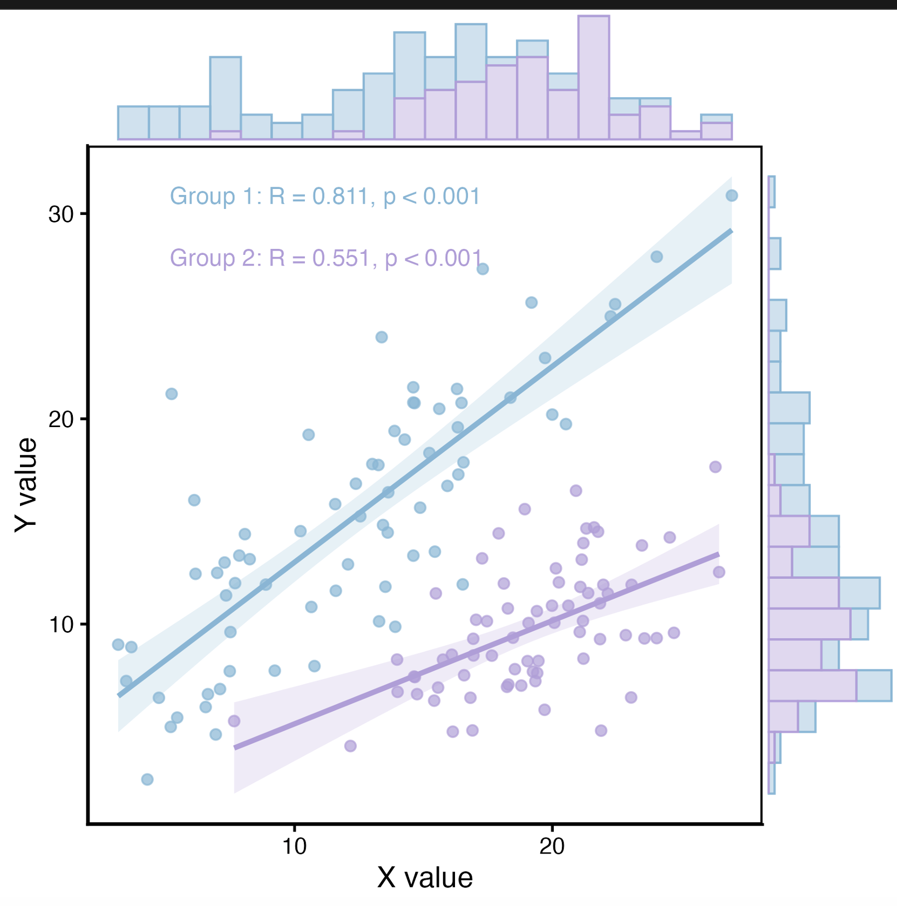
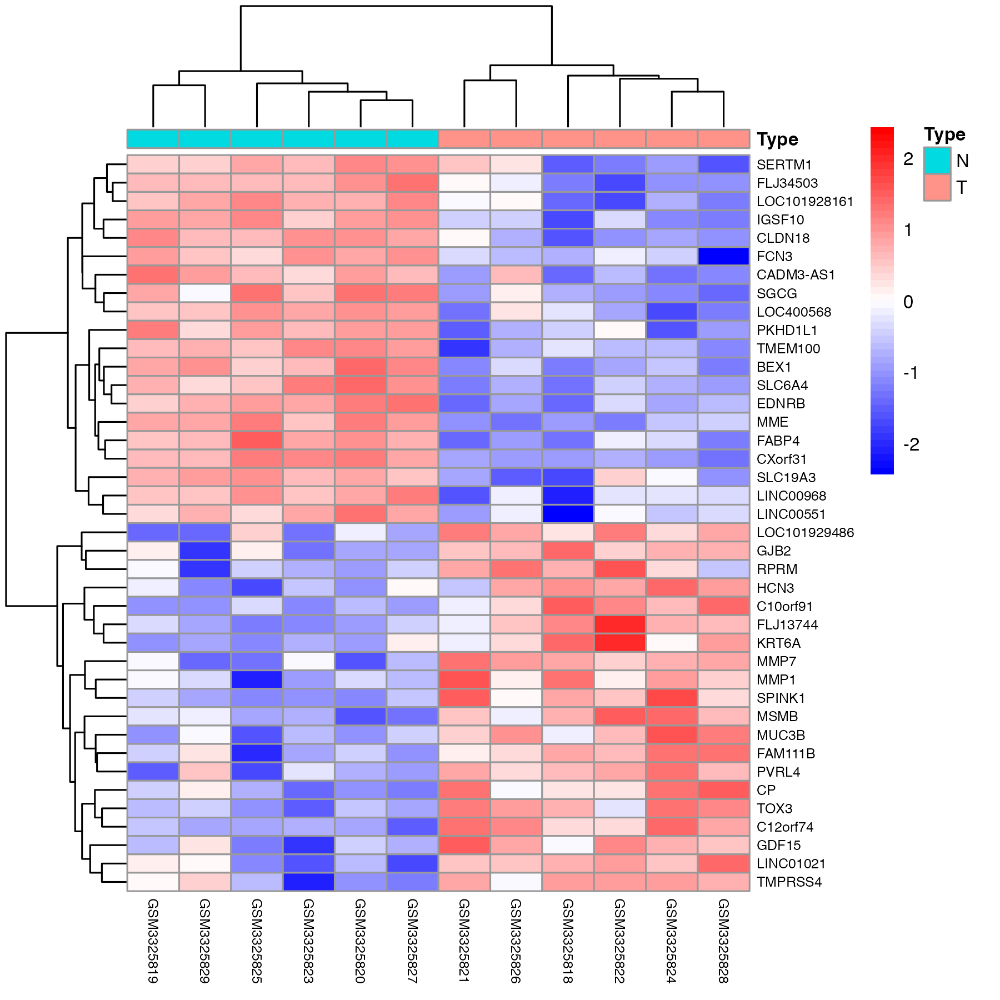

# R Plot Gallery

Collection of **R scripts for statistical visualization and exploratory data analysis**.

This repository will contain **50 commonly used plots for statistics, data science, econometric, and bioinformatics.**

---

## Plot Gallery

<table>
<tr>

<td align="center">
<a href="1_VolcanoPlot">
 
<b>1. Volcano Plot</b>
</a>
</td>

<td align="center">
<a href="2_SurvivalCurve">
 
<b>2. Survival Curve</b>
</a>
</td>

<td align="center">
<a href="3_RegressionScatterPlot">
 
<b>3. PCA Plot</b>
</a>
</td>

</tr>

<tr>

<td align="center">
<a href="4_heatmap">
 
<b>4. Heatmap</b>
</a>
</td>

<td align="center">
<a href="5_Boxplot">
 
<b>5. Boxplot</b>
</a>
</td>

<td align="center">
<a href="6_ROC">
 
<b>6. ROC Curve</b>
</a>
</td>

</tr>
</table>

---

## Author

Bingchen Li
